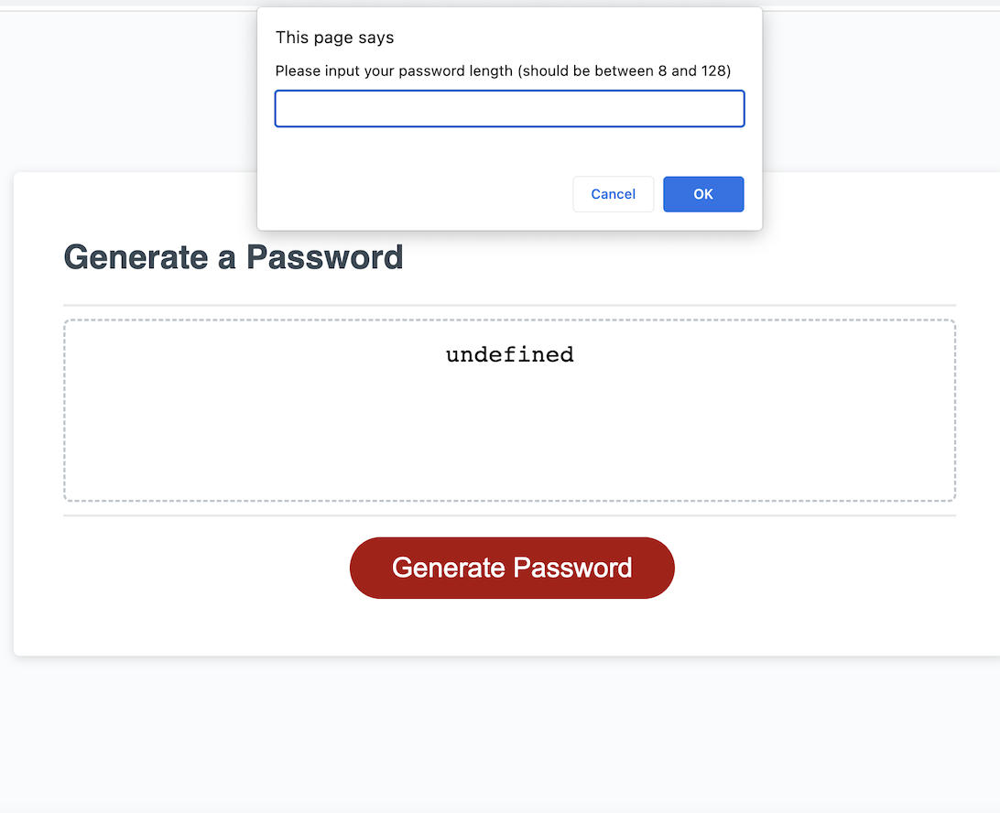

# Random Password Generator Project

## About This Project
This project is to generate a random password include at least one criterial which are uppercase/lowercase/number/symbol.
Here are the steps to accomplish this project: 
  - prompt windows to let view input numbers and pick options.
  - solve the problem of how to generate a random combination.
  - successfully connect js to html through API.

I spend lots of time figure out how to generate a series of number with certain criterial. 
      
## Installation
N/A

## Usage

Step:
  - 1. CLick 'Generate Password' button to choose password length
  - 2. Choose if to include Uppercase/Lowercase/Number/Symbol not not
  - 3. Password generated

;

## Credits
N/A

## License
N/A